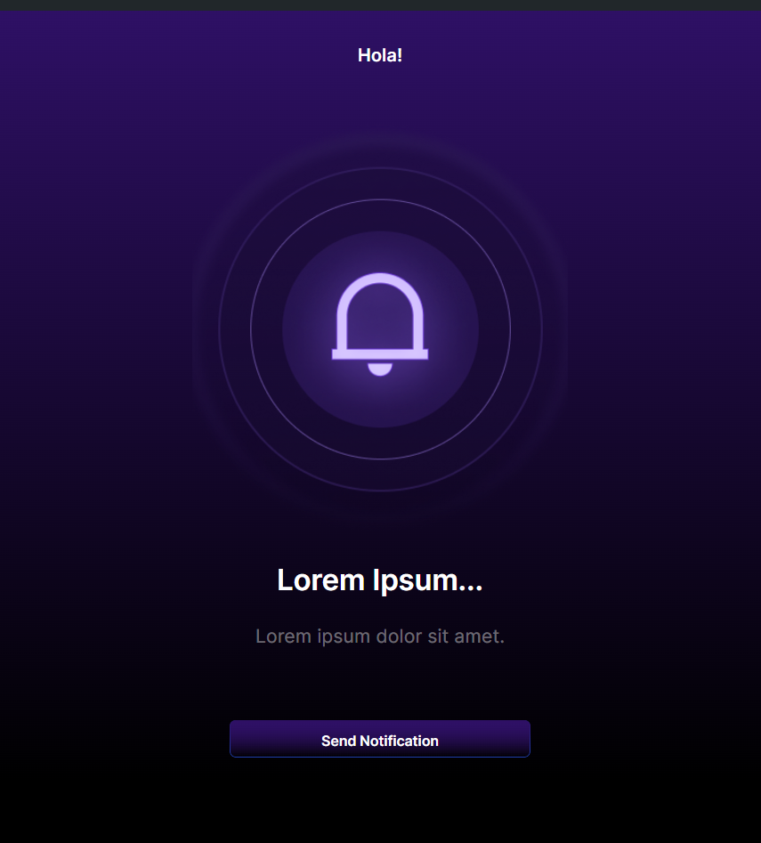

#  Internship Task

Welcome to the DiGiLABS Internship Task repository! This repository contains the code for the web project developed as part of the internship task.

## Project Overview

This project is a web application developed using Next.js, a React framework for building server-side rendered and statically generated applications. The project includes the following features:

- Front end developed based on the provided UI/UX design in Figma.
- PWA (Progressive Web App) setup for improved user experience.
- Implementation of notifications: Sending notifications when a user taps on the 'Send Notification' button.

## Preview

You can preview the project [here](https://notification-task-i9ps4kzfj-sparshrexs-projects.vercel.app/).

## Technologies Used

- Next.js
- React
- Tailwind CSS

## How to Run Locally

To run the project locally, follow these steps:

1. Clone this repository to your local machine.
2. Navigate to the project directory.
3. Install dependencies using `npm install`.
4. Start the development server using `npm run dev`.

The project will be running at `http://localhost:3000`.

## Contributing

Contributions to this project are welcome. If you find any issues or have suggestions for improvements, please feel free to open an issue or create a pull request.

## License

This project is licensed under the [MIT License](LICENSE).
